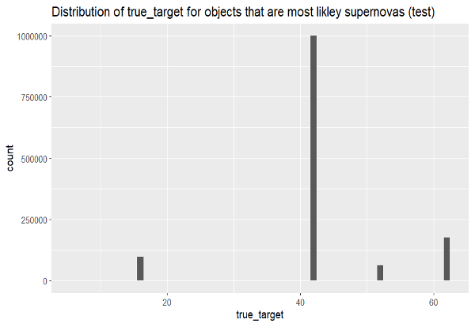

# SupernovaClassifier

The format of this report is for a Capstone project where the goal was to ask and answer a question about the PLAsTiCC data set, [found here](https://www.kaggle.com/competitions/PLAsTiCC-2018/data).
The data used for this report was the lightcurve and metadata. 

# Transients and Supernovas: an intro to classification
## Abstract:
This project is the result of a Capstone project where the main goal was to use PLAsTiCC data, and try to learn something new about transients and supernovas.
My goal with this repository is to show what I learned throughout the process. I decided to focus on classification models, more specifically, which type of classification model can most accurately classify supernovae from the PLAsTiCC data as well as what variables best are most important in the classification. The motivation for this focus is to true to the initial PLAsTiCC challenge which was focused on using ML models to address this same question. This project does however take a slightly different route however as rather than just focusing on the model itself the aim was also to try to see which variables were most impactful in the classification. The success of my analysis is measured by the accuracy of the best performing model 

In order to do this, I found that the lightcurve and metadata datasets would be best to create new variables that have standardized thresholds that scientists already use to classify supernovas. The data itself would have to be cleaned and processed before being fed into the classification models that would be validated, these models would be ctree, cforest, rpart and rforest. In this paper it will be revealed that with the provided train test splits it is possible to achieve a model with an accuracy of ~85% which is fairly significant. Further the variables used by the model are actually representative of real-world classification thresholds, which further boosts the significance of my findings. 
 However, it should be said that my answer to what variables are best for classification of supernovae is not going to be 100% correct in this analysis, due to a variety of reasons that this report will get into and therefore the analysis and insight provided should only be seen as a way of understanding existing thresholds and only represents a basic supernova classification model.
 

## Introduction:
The driving quesiton behind this report is: How can we classify transients as supernovas using a combination of lightcurve and metadata and what type of tree produces the best results?
This question focuses on using two types of data from the PLAsTiCC; lightcurve and metadata, in order to produce classification models that can predict transient events as supernovas, with some accuracy.
In order to properly understand how this question was answered a few terms should be defined:

1.	Transients:
* Transients are formally defined as astronomical phenomena with durations of seconds, weeks or years. (https://www.nature.com/subjects/transient-astrophysical-phenomena) 
2.	Supernovas:
* A supernova is what happens when a star has reached the end of its life and explodes in a brilliant burst of light. (https://www.space.com/6638-supernova.html) 
* 6 supernova classes (PLAsTiCC defines them as 6,16,42,52,62):
    *	class 6: SNIa (Type Ia supernova)
    * class 16: SNIbc (core-collapse supernova Type Ibc)
    * class 42: SNIIn (Type IIn supernova)
    * class 52: SNII (core-collapse supernova Type II)
    * class 53: SNIIL (Type II-L supernova)
    * class 62: SNIIb (Type IIb supernova)
3.	Flux:
* Flux (or radiant flux), F, is the total amount of energy that crosses a unit area per unit time. (https://astronomy.swin.edu.au/cosmos/F/Flux)  
4.	Absolute/Apparent Magnitude:
* The absolute magnitude of a star, M is the magnitude the star would have if it was placed at a distance of 10 parsecs from Earth. (https://astronomy.swin.edu.au/cosmos/A/Absolute+Magnitude) 
* The apparent magnitude of a celestial object, such as a star or galaxy, is the brightness measured by an observer at a specific distance from the object. (https://astronomy.swin.edu.au/cosmos/A/Apparent+Magnitude) 
5.	Luminosity:
* Measure of the total amount of energy radiated by a star or other celestial object per second. (https://www.atnf.csiro.au/outreach/education/senior/astrophysics/photometry_luminosity.html)

## Data:
The data used to answer the driving question is broken down into 2 major groups, lightcurve and metadata [and can be found here](https://www.kaggle.com/competitions/PLAsTiCC-2018/data). The key terms used throughout this report are defined below. 
1.	Lightcurve data
* Light curves are designed to make graphs that show the brightness of an object over a period, depending on passband information (the wavelength that the object was detected in I.e., visible, IR, blue etc.).
2.	Metadata
* Data of data, this includes more technical data including distance, redshift and true data, meaning the actual measurements for certain variables, corrected for potential errors.
With these definitions in mind, I can now explain how the data was used to answer the driving question.  The data usage was primarily broken up into 4 parts: initialization, filtering, processing and post processing.
 	The data initialization is straightforward, using the ```read_csv``` function in R, I loaded 2 types of data, training and testing. The training data included “plasticc_train_lightcurves.csv” and “plasticc_train_metadata.csv” with sizes ~1.4 million and ~7.5 thousand, respectively. The testing data however included “plasticc_test_set_batch1.csv” which PLAsTiCC defines as the deep drilling field (DDF) which includes higher quality data, and “plasticc_test_metadata.csv” with sizes ~11 million and ~3.5 million, respectively.
  
Given this information there is a glaring issue, with any classification models, the training testing split should be 60-40, 70-30 or 80-20 (in common cases), however the difference between these two is roughly 800% in favor of the TESTING data. As a result, there will be huge discrepancies in the actual predictions due the differences in data, however, staying true to the nature of the competition that this data was used for, I did NOT create mock data or sample existing data in order to try to keep my predictions as accurate as possible to the real circumstances (and because it would not have been computationally feasible for creating classification models using the built in functionality of R).
Once the data was initialized, the next step was filtering it, knowing the 6 class labels for potential supernovas I used the filter function to filter the training data to only include transients who’s ```true_target``` was one of the 6 previously named classes. The code for both the training and testing was as follows: 
```R potential_supernovas_train <- meta_data_train %>% filter(true_target <= 95, true_target %in% c(6, 16, 42, 52, 53, 62))  
potential_supernovas_test <- meta_data_test %>% filter(true_target <= 95, true_target %in% c(6, 16, 42, 52, 53, 62)) 
```
Once the data was filtered it was now time to process it. Initially, the lightcurve data contained many instances of the same object, in order to show changes in that objects flux over time, so, in order to create new variables that can be used in the classification models I had to mutate the existing data. The initial mutations were to create new columns ```absolute magnitude``` and ```luminosity```, this was done in two parts, shown below, by first filtering non transient objects and then merging the metadata to the lightcurve data by reference ```object_id``` and then converting the data in the new variables using the functions that can be found in the appendix.
```R 
  filter_lightcurve_data <- lightcurve_data_param %>% 
    filter(flux != 0, object_id %in% potential_supernovas_param$object_id) 
  passbands = c("u", "g", "r", "i", "z", "y")
   mut_filter_lightcurve_data <- filter_lightcurve_data %>% mutate(passband_letter = passbands[passband + 1])
  mut_meta_lightcurve_merge <- merge(mut_filter_lightcurve_data, potential_supernovas_param, by = "object_id", all.x = TRUE)

mut_meta_lightcurve_merge_abs_mag <- mut_meta_lightcurve_merge %>% rowwise() %>% mutate(
  absolute_magnitude = calculate_absolute_magnitude(flux, true_distmod, passband_letter),
  luminosity = calculate_luminosity(flux, true_distmod)) #functions omitted from paste because of their size.
```
The reason why mutating the existing flux data and converting it to absolute magnitude and luminosity was needed is due to the discrepancies in the data, being the fact that Flux cannot be negative. Initially, there were many cases where negative flux was recorded, meaning that the object was absorbing energy, which only really happens with black holes. Thus, in order to standardize the data and be able to apply commonly accepted thresholds, I needed to convert them to standardized metrics, being magnitude and luminosity. Moreover, much of the research I found described that these two metrics were most useful in classifications without any knowledge of the type of elements being released from the explosions (which was not included in my data sets)
 


This table shows the general classification thresholds for classifying supernovae which inspired my choice of variables. (https://en.wikipedia.org/wiki/Supernova)
The only remaining processing that was needed for this data was to do some small calculations to add days from peak to 50% (I used 50% instead of 10% for reasons I'll get into shortly). The reason why the days from peak to 10% luminosity is an important metric is because it shows a violent peak and a quick drop-off, indicating a large explosion with a quick fade away, characteristic of almost all supernovas. The reason why I chose 50% leads to the final part of the data management which was post processing. 
The post processing of the data involved using the new variables to filter any values that are not acceptable, specifically for days to 50% luminosity. The reason behind this was because not all transients had been recorded for a period long enough to notice a 50% change in luminosity. The code to check for that is below:
```R  df_50pct_luminosity <- mut_meta_lightcurve_merge_abs_mag %>% group_by(object_id) %>% filter(luminosity <= 0.5 * max(luminosity), mjd > mut_meta_lightcurve_merge_abs_mag[match(max(luminosity),                                        mut_meta_lightcurve_merge_abs_mag$luminosity), ]$mjd) %>% summarize(
    object_id = object_id[1],
    val_50pct_luminosity = luminosity[1],
    mjd_50pct_luminosity = mjd[1]
    ) %>% select(object_id, mjd_50pct_luminosity, val_50pct_luminosity)
```
This code returned some NaNs which were then filtered out, reducing the total data from well over a million to only ~3 thousand and ~20 thousand for the train and test values respectively.  This filtering, while greatly reducing run-time, did create some problems, which I will further explore in the results section. The values returned from the filtering were then used to summaries key variables that would be used in the actual models. These variables were the: object id, max absolute magnitude, min absolute magnitude, max luminosity, min luminosity, days to 50% luminosity, the vpec (negligible) and the date range that the transient was recorded in.  

# Methods and Analysis

The methods and analysis used for the classification were built on the data management as all that needed to be done once the data was cleaned and processed was to use it in the classification models. In order to validate the accuracy of a model I created 4 models (ctree, cforest, rpart, rforest) all using the same independent variables in their formulas, this process would allow me to compare model accuracy.
The actual process, summarized can be described as follows:
1.	Prepare data by cleaning and merging lightcurve and metadata.
2.	Ensure that the data you are dealing with is only values you are interested in classifying (6,16,42,52,53,62). 
3.	Create a summary function that outputs a dataframe containing all variables that would be used in the models, ensure that all NaNs are cleaned and that outliers are removed (some of the formulas used to create the variables tested can be found in the appendix).
4.	Use the summaries in order to train the models you are interested in testing; this is where you should experiment with different combinations of variables and see what provides the best splits. 
5.	Use the models and testing data provided to create predictions.
6.	Create confusion matrices from the predictions
7.	Calculate the percent of TP or TN from the total number of predictions and you have the success rate of different classification models.
The code for generating the for generating the models was as follows

The predictions were then used to create confusion matrices, which would show me the amount of true positive, true negatives, false positives and false negatives for the predicted supernova class vs the actual supernova class.
The confusion matrices were then used to show the percentage of correct predictions and then plotted and compared which will be covered in results.

# Results:

The results of the classification predictions were successful with the results being grouped in the table below and the visualizations previously mentioned in the data visualization section. 
| Model  | Percent correct |
| :--- | ---: |
| ctree| 0.8420941       |
| cforest| 0.8425193        |
| rpart| 0.8426256        |
| rforest| 0.8170077        |

**NOTE**: The formula for all models was ``` class_label ~ max_absolute_magnitude + min_absolute_magnitude + max_luminosity + min_luminosity + days_to_50pct_luminosity + vpec```, it would have been possible to obtain more accurate results by introducing weights and processing the data further, however the purpose of this project was to be a way of learning more about the subject and about implementation of classification models.
The table shows that rpart was the most accurate model by ~0.0001%, suggesting that there was no noticeable difference between the Gini coefficient (default error measurement with rpart) and the significance tests used by ctrees. Interestingly the forests both performed worse than the individual trees, this may be due to imbalanced data which is an isue I described earlier in this report.
In conclusion the best classification model for this data set is rpart (recursive partitioning) with correct prediction rate of ~85%. The variables with the highest importance were: max_absolute_magnitude, min_absolute_magnitude, max_luminosity, min_luminosity. 
The issue with these results however was the fact that the models both neglected 2 classes, being 52 and 62, which low in count raises a huge red flag in terms of the actual accuracy of the model. The actual reasoning behind this is most likely due to the data itself, however I will get into further reasoning in the discussions section.


# Data visualizations:

rpart model          | ctree model
:-------------------------:|:-------------------------:
  |  

These two images show the actual models that are generated using rpart and ctree, respectively. You can see the great number of splits using ctree, however the actual splits themselves only categorize 4 of the 6 classes. This can be attributed to the heavily imbalanced data.
 


This graph is essentially a summary of the model success rates.
  
training data         | testing data
:-------------------------:|:-------------------------:
  |  

The above graphs show the distribution of true_target data for transient objects that most likely classify as supernovas (class 6, 16, 42, 52, 53, 62) and there is a clear bias in both the training and testing data, which will heavily skew the classification. 


# Discussion: 
The results themselves are fairly straightforward, however this would be a good time to discuss the role that the previously mentioned issues would play in the results themselves. The most significant issue was the imbalanced data, which would lead the models to being improperly trained and biased, which was the case. While this does not seem clear at first, using graphs showing the potential error with the data we can see that the missing 2 classes that the model did not categorize well (class 52 and 62).
I touched on a potential reason for this issue being that in the data, both train and test, there were clear discrepancies in the ammount of data for those objects and further, the normal solutions to dealing with this issue (resampling and making mock data) would not have been feasible in this case as I would be sacrificing run time or creating inaccurate data. 
Another potential issue would have been underfitting the data, which may be surprising given the number of parameters used in the models. The data provided for the lightcurve data was restrictive and the only reason I was able to get the results I had obtained was because of the merge with the metadata. While it would have been possible to find more combinations of variables, the amount of time I had to create the models and presentation did not allow for that. 
In terms of statistical significance and broader use for this information I would say that a model like this would be useful in terms of classification of supernovae within PLAsTiCC, thus making it statistically significant. However, the clear issue that exists with this is the fact that the data required to make these models work needs to be specifically curated, meaning that the algorithms and models themselves are not that robust for externalities or error handling. Thus, while the best model performed well in this fairly closed off context it would be a reach to say that the models would be able to outcompete even the most basic machine learning algorithms. The reason for this is with machine learning, there is an almost infinite number of versions can be created to find the best fit even with a relatively small training set, however in my circumstances the time and feasibility of doing so with the models I used was not there. 

# Conclusion:
The end result of this inquiry allowed me to create 4 classification models for the PLAsTiCC dataset with varying performance. The goal was to use a combination of lighcurve and metadata to create variables that already have standardized thresholds in order to see how well they perform in a classification model.

The data itself was cleaned and then processed in order to create summary observations which could then be used directly by classification models. The benefit of this method was the high accuracy of prediction being ~85% with the best model, however due to a variety of factors including imbalanced data, efficiency and underfitting I was not able to achieve a higher accuracy. While 85% is a high success rate, the rpart model, which was the best performing cannot truly compare against other machine learning algorithms that would have taken much more time to create.
Thus, while the models created to answer the driving question do not actually have much real-world use outside of the scope of this challenge, it is still interesting to see how well an algorithm such as rpart can perform without many tweaks and how well it recognized the best variables to make its split with, being max absolute magnitude, min absolute magnitude, max luminosity, min luminosity. While I would have liked to see better performance in the classifications, the end results still proved to be quite successful and interesting and leave room for further exploration and improvements. 
All in all, given the handicaps with the data and the time restriction on the delivery itself, I am very pleased with an 85% success rate and the fact that the model correctly used magnitude and luminosity as the main driving force behind the classification, which does indeed mimic real world classification thresholds.


# Sources:

https://www.nature.com/subjects/transient-astrophysical-phenomena
 https://www.space.com/6638-supernova.html
 https://astronomy.swin.edu.au/cosmos/F/Flux
 https://en.wikipedia.org/wiki/Absolute_magnitude
 https://astronomy.swin.edu.au/cosmos/A/Absolute+Magnitude
 https://www.astronomy.ohio-state.edu/martini.10/usefuldata.html
 https://en.wikipedia.org/wiki/Supernova
 https://www.atnf.csiro.au/outreach/education/senior/astrophysics/photometry_luminosity.html
 https://astronomy.swin.edu.au/cosmos/A/Apparent+Magnitude
https://itu.physics.uiowa.edu/labs/advanced/astronomical-redshift
https://astronomy.swin.edu.au/cosmos/d/Distance+Modulus\
https://en.wikipedia.org/wiki/Inverse-square_law

Appendix: 
Question 1:
Below is the code for generating the variables mentioned throughout the report: 
Values from https://www.astronomy.ohio-state.edu/martini.10/usefuldata.html
```R
get_zero_point_flux_mag <- function(filter){
  f_0 = 0
  #m_0 = 0
  if(filter == "u"){
    f_0 = 1810#Jy
    #m_0 = 23.9#Jy
  } else if (filter == "g"){ #SDSS passbands calculated with Vega as zero point reference
    f_0 = 3640
    #m_0 = 25.1
  } else if (filter == "r"){
    f_0 = 3080
    #m_0 = 24.4
  } else if (filter == "i"){
    f_0 = 2550
    #m_0 = 24.1
  } else if (filter == "z"){
    f_0 = 1800
    #m_0 = 22.8
  } else if (filter == "y"){ 
    f_0 = 1080
    #m_0 = 20.9
  }
  else{
    f_0 = NULL
    #m_0 = NULL
  }
  return(f_0)
}

#formulas below from https://en.wikipedia.org/wiki/Absolute_magnitude 
calculate_apparent_magnitude <- function(flux, filter){
  # We assume the flux of the objects are already converted to Jy
  f <- abs(flux) # to avoid NaNs from log(-x)
  return(-2.5 * log10(f/get_zero_point_flux_mag(filter)))
}
 
calculate_absolute_magnitude <- function(flux, distance, filter) {
  # We assume the flux of the objects are in nanomaggies given their size.
  # We assume distance is in the modulus scale
  # We assume filter is one of (u g r i z y)
  # Values of f_0 are using SDSS standards.
  f <- abs(flux) * 3.631 * 10^(-6) # to avoid NaNs from log(-x) and to convert to Jy from nanomaggies
  apparent_magnitude <- calculate_apparent_magnitude(f, filter)
  return(apparent_magnitude - distance)
}
 
calculate_luminosity <- function(flux, distmod){
  # We assume flux is in nanomaggies
  # We assume distmod is in distmod
  distance_parsec = 10^(distmod/5 + 1)
  flux_erg = flux * 3.631e-6 * 10^(-0.4*distmod) 
  return(4*pi * (distance_parsec)^2 * flux_erg)
}
```
